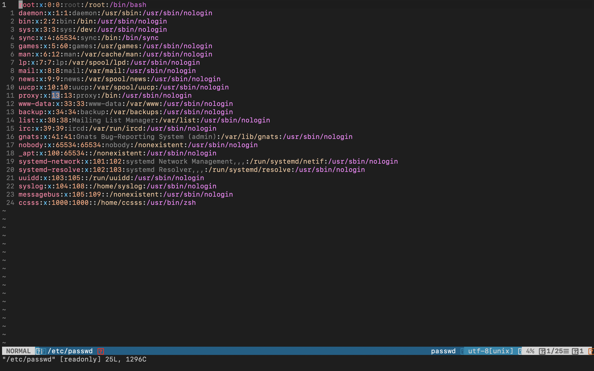

# vim-airline

>vim 보기를 예쁘게 해주는 것을 설치했다. 
가장 대중적인 것이라고 해서 설치했다. 

[vim-airline 이상적인 동작 link](https://my.yirum.net/vim-%EC%8A%A4%ED%83%80%EC%9D%BC%EB%A7%81-colorscheme-%EA%B3%BC-vim-airline-%EC%84%A4%EC%B9%98/)

  
### 현재 내 vim-airline 실행

분명 아래 화면이 바뀐 것 같긴 한데 정확히 뭐가 변경되었는지는 모르겠다.

기능은 두가지 인듯하다
>1.예쁜 테마 제공 2.내가 입력하는 글자수 세어주기

아래 링크를 접속하면 어떻게 해야 할지 쉽게 알 수 있다. 기본적으로 vundle이라는 것을 설치한 뒤에 진행해야 한다. 
[vim-airline 설치가이드](https://rudalskim.tistory.com/74)

