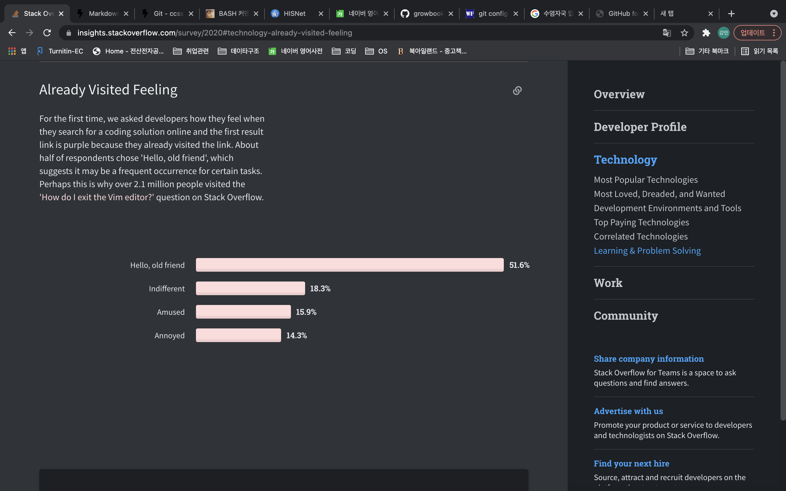
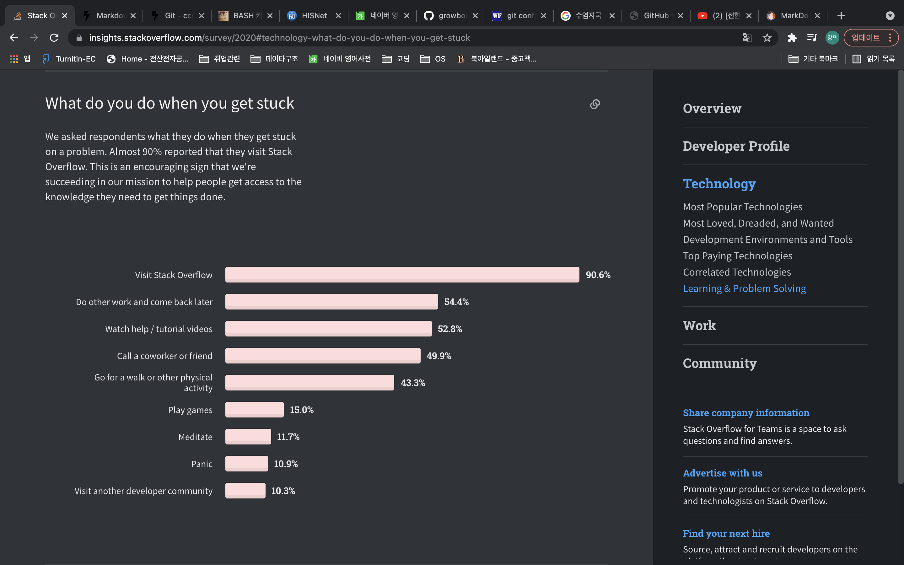

# **검색했던 것을 다시 봤을 때에 느낌 설문조사**


- 51.6%의 사람들은 반가움을 느꼈다
- 18.3% 사람들은 아무것도 못 느꼈고
- 나머지 사람들은 즐겁거나 화난다고 응답했다.

참조 링크 : [github](https://insights.stackoverflow.com/survey/2020#technology-already-visited-feeling)


# **코딩하다 막혔을 때에 뭘하는지**


90%의 사람들이 stackoverflow를 사용한다고 한다..<br>
~~(해당 사이트에서 조사했으니 당연한 말..)~~
```
90%의 사람들이 stackoverflow를 사용한다고 한다..<br>
~~(해당 사이트에서 조사했으니 당연한 말..)~~
```
>재밌는 영상

[youtube](https://www.youtube.com/watch?v=E_xcGkRXy7c&t=1911s)

[hisnet link](https://hisnet.handong.edu/)

*한글이 포함되어 있으면 사진이 잘 안열리는 것 같다.*
